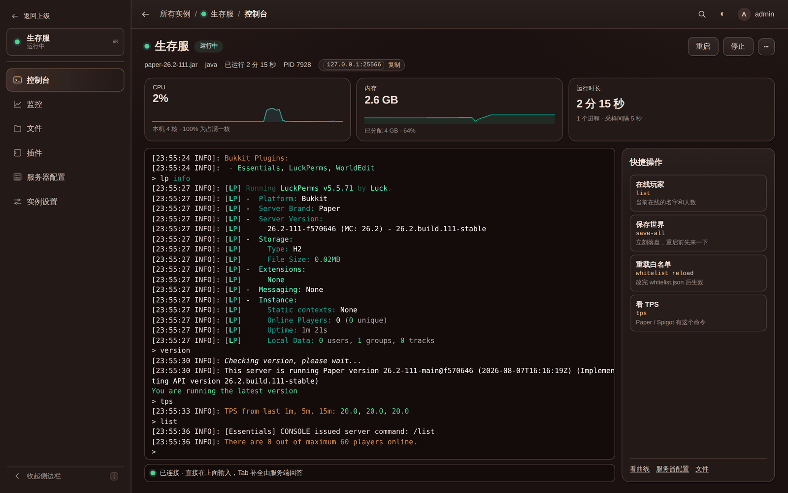
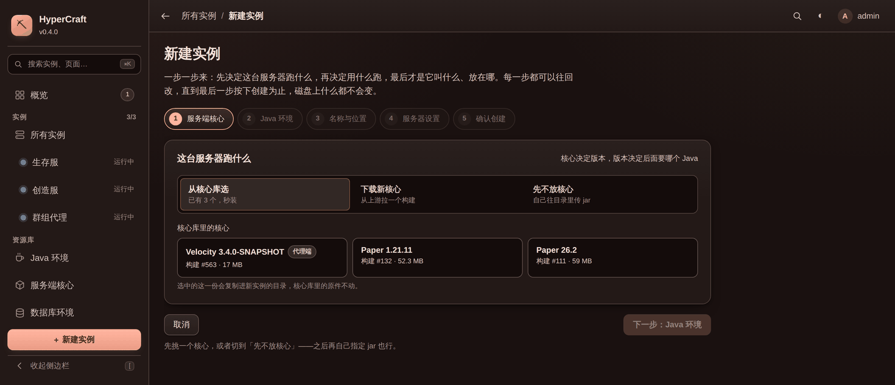
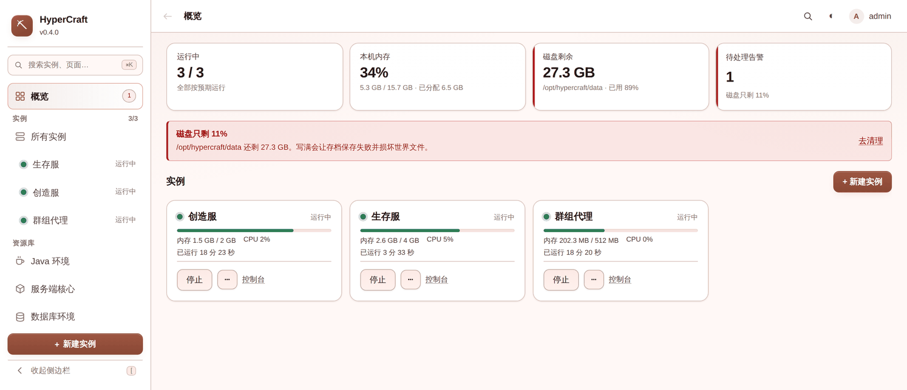
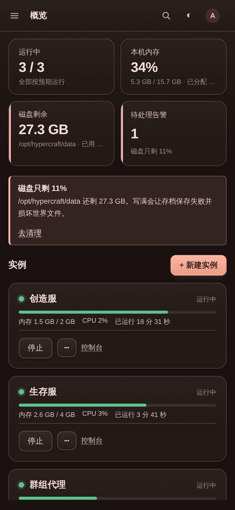
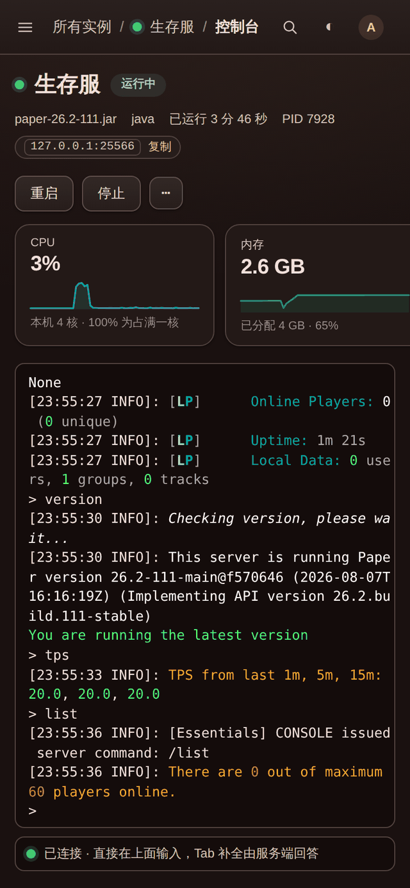

<div align="center">


# HyperCraft

**自托管的 Minecraft 服务器面板 —— 一个二进制文件，一台机器，任意多个服务端。**

浏览器里的控制台、文件管理、插件管理、Java 环境和资源监控。<br>
无运行时依赖，无数据库，无 Docker：下载、解压、启动。

[](https://github.com/Lanscarlos/HyperCraft/actions/workflows/ci.yml)
[](https://github.com/Lanscarlos/HyperCraft/releases/latest)
[](https://github.com/Lanscarlos/HyperCraft/releases)
[](https://go.dev)
[](LICENSE)

[快速开始](#快速开始) · [界面](#界面) · [文档](#文档) · [更新日志](CHANGELOG.md)

</div>


## 它解决什么

开一台 Minecraft 服务器要凑齐的东西不少：对得上版本的 Java、服务端核心、插件、一份改起来容易出错的
`server.properties`，以及一个「关掉 SSH 也不会把服务器带走」的运行方式。HyperCraft 把这些收进一个
浏览器界面里，而进程本身仍然由一个守护进程持有 —— 网页只是它的遥控器。

```
                 ┌──────────────────────────────────────────┐
   浏览器 ──ws──▶ │  hypercraft 守护进程                      │
   浏览器 ──ws──▶ │                                          │
   (随便开几个、   │   ┌──────────┐   stdin/stdout            │
    随便关)       │   │ 实例 A    │◀──────────▶ java -jar …   │
                 │   │ 环形缓冲   │                          │
                 │   └──────────┘                           │
                 │   ┌──────────┐                           │
                 │   │ 实例 B    │◀──────────▶ ./bedrock_…   │
                 │   └──────────┘                           │
                 └──────────────────────────────────────────┘
```

关掉标签页、退出登录、断网、重启路由，服务器照跑；输出继续写进环形缓冲区，下次打开控制台先补齐这段
时间的历史再接上实时输出，断线重连按行号补缺口，不重复也不遗漏。唯一会停下服务器的是**停止面板本身**，
而且是优雅停止：先发 `stop`、等世界存盘、超时才升级到信号。

## 特性

| | |
| --- | --- |
| **多实例管理** | 一台机器上任意多个服务端，侧栏实时状态；启动 / 优雅停止 / 重启 / 强制结束，可选崩溃自动重启 |
| **真终端控制台** | 服务端跑在伪终端上，Tab 补全由**正在运行的服务端**回答，进度条、颜色、窗口宽度都是真的 |
| **Java 环境** | 一键装 Eclipse Temurin 的 JRE / JDK，多版本共存，1.12 的老服和最新版可以在同一台机器上跑 |
| **服务端核心库** | 面板级的 jar 货架，Paper / Velocity 直接下载，一次下载复制给任意多个实例 |
| **插件管理** | 从 Modrinth / Hangar / SpigotMC / GitHub Release 拉插件，全局库 + 实例两层，每个版本单独留存可回滚 |
| **文件管理器** | 浏览、上传（拖拽、断点续传）、在线编辑配置；所有路径经 `os.Root` 由内核关在实例目录内 |
| **配置编辑器** | `server.properties` 表单化，保留注释与键顺序，中文自动转义，只写你真正改过的键 |
| **资源监控** | 每实例 CPU / 内存曲线 + 整机内存、磁盘、CPU 和网络流量，采集在守护进程里，关掉网页也不断档 |
| **数据库环境** | 一键装起并跑起 MySQL / PostgreSQL / MongoDB，给需要数据库的插件用 |
| **本机终端** | 面板所在机器上的一个真 shell（默认关闭），装插件、看日志不用另开 SSH |
| **面板自更新** | 界面上点一下就换二进制并原地重启，先停服再替换，失败自动回滚并把服务器拉回来 |
| **安全默认值** | PBKDF2-SHA256 密码、登录限速与并发派生上限、HttpOnly + SameSite 会话、设备令牌、真实客户端 IP 识别 |

移动端是一等场景：窄屏下优先保住状态、开关机和控制台。界面跟随系统明暗主题。

## 快速开始

发布产物是**单文件二进制**，前端已经嵌在里面，目标机器上不需要 Go、Node、Java 或任何运行时 ——
服务端要的 Java 面板自己会装。

```bash
sudo mkdir -p /opt/hypercraft && cd /opt/hypercraft
sudo wget https://github.com/Lanscarlos/HyperCraft/releases/download/v0.4.0/hypercraft-0.4.0-linux-amd64.tar.gz
sudo tar -xzf hypercraft-0.4.0-linux-amd64.tar.gz --strip-components=1
sudo cp hypercraft.service /etc/systemd/system/ && sudo systemctl enable --now hypercraft
sudo journalctl -u hypercraft -f     # 首次启动的随机管理员密码打印在这里，只显示一次
```

打开 `http://你的服务器IP:19190` 登录，然后按「新建实例」向导走一遍：挑核心 → 装 Java → 起名字和
位置 → 服务器设置 → 创建。ARM 机器把 URL 里的 `amd64` 换成 `arm64`；国内机器在 URL 前面加
`https://ghfast.top/` 前缀。

> [!IMPORTANT]
> 面板默认监听 `0.0.0.0:19190`，讲的是明文 HTTP，并且能在这台机器上执行控制台命令。要挂在公网上，
> 请先配好 TLS（[反代](docs/deployment.md#反向代理与-tls) 或 [自带证书](docs/deployment.md#直接跑-https)），
> 或者把 `-listen` 收回 `127.0.0.1` 走 SSH 隧道。

完整的部署步骤、专用用户、防火墙和反代配置见 **[部署指南](docs/deployment.md)**。

## 界面

<table>
<tr>
<td width="50%"><br><sub><b>控制台</b> —— 伪终端上的服务端，Tab 补全和颜色都来自它本身</sub></td>
<td width="50%"><br><sub><b>新建实例</b> —— 五步向导，缺核心或缺 Java 就在那一步装</sub></td>
</tr>
<tr>
<td><br><sub><b>文件管理器</b> —— 上传、下载、在线编辑，路径关在实例目录内</sub></td>
<td><br><sub><b>服务器配置</b> —— 常用项表单化，其余键原样保留</sub></td>
</tr>
<tr>
<td><br><sub><b>插件库</b> —— 按插件看：谁装在哪几台、版本对不对得上</sub></td>
<td><br><sub><b>Java 环境</b> —— 多版本共存，正在跑的不让删</sub></td>
</tr>
<tr>
<td><br><sub><b>服务端核心</b> —— 下载走服务器的网络，关掉网页也会继续</sub></td>
<td><br><sub><b>主机监控</b> —— 内存、磁盘、CPU 和网络流量</sub></td>
</tr>
</table>

<details>
<summary><b>还有：本机终端、浅色主题、手机端</b></summary>

<br>


<sub>**本机终端** —— 面板所在机器上的真 shell，默认关闭；配色与服务器控制台刻意不同，防止把命令敲错地方</sub>

<br>


<sub>**浅色主题** —— 跟随系统，也可以手动切换</sub>

<br>

<table>
<tr>
<td width="50%"></td>
<td width="50%"></td>
</tr>
</table>
<sub>**手机端** —— 侧栏收成抽屉，状态、开关机和控制台优先</sub>

</details>

## 文档

| 文档 | 内容 |
| --- | --- |
| [部署指南](docs/deployment.md) | 下载安装、systemd、命令行参数、数据目录、反代与 TLS、防火墙、备份 |
| [上手指南](docs/getting-started.md) | 开第一个服的完整流程、导入机器上已有的服务器、常见问题 |
| [功能详解](docs/features.md) | Java 环境、核心库、插件、文件管理、数据库、监控、本机终端、面板自更新 |
| [控制台](docs/console.md) | 终端模式与管道模式、Tab 补全、颜色、中文编码 |
| [安全与访问控制](docs/security.md) | 登录限速、真实客户端 IP、设备令牌、原生客户端接入 |
| [开发指南](docs/development.md) | 从源码构建、项目结构、测试与 lint、发布流程 |

## 还没做的

按优先级：玩家列表和白名单 / OP 管理（现在只能手改 JSON）、自动备份、多用户和权限、定时任务（定时
重启 / 广播）、更多可下载的核心（Fabric / Forge / 基岩版）、更长的监控历史（现在只在内存里存 1 小时）、
Windows 上的终端（需要接 ConPTY）。

已知边界：Temurin 只有 glibc 构建，musl 系统（Alpine 之类）装了跑不起来，面板会检测到并直接说明。

## 从源码构建

需要 Go 1.25+ 和 Node 20+：

```bash
git clone https://github.com/Lanscarlos/HyperCraft.git && cd HyperCraft
make deps      # 装前端依赖（只需一次）
make build     # 构建前端 + 编译出单二进制 ./hypercraft
./hypercraft -data ./data
```

后端只有三个直接依赖（`gorilla/websocket`、`shirou/gopsutil`、`golang.org/x/text`），前端不引 UI 框架
和图表库。面板自身实测常驻堆内存约 2 MB。详见[开发指南](docs/development.md)。

## 协议

[MIT](LICENSE)
