# 功能详解

这一页是每个功能背后的取舍和边界。只想把服开起来的话，[上手指南](getting-started.md)就够了。

- [全局仪表盘](#全局仪表盘)
- [多实例与进程管理](#多实例与进程管理)
- [Java 环境](#java-环境)
- [服务端核心库](#服务端核心库)
- [插件管理（全局 + 实例两层）](#插件管理全局--实例两层)
- [数据库环境](#数据库环境)
- [文件管理器](#文件管理器)
- [server.properties 编辑器](#serverproperties-编辑器)
- [资源监控](#资源监控)
- [本机终端](#本机终端)
- [面板自更新](#面板自更新)

## 全局仪表盘

首页一眼看完：实例运行中 / 总数、已装 Java、核心库存量、插件更新、面板版本，加上整机的内存 / 磁盘
水位和 CPU 曲线；实例卡片上直接有启动 / 停止按钮，不用先进控制台。磁盘快满时会顶一条告警 —— 写满会
让存档保存失败并损坏世界文件，这是最值得提前一天知道的一件事。

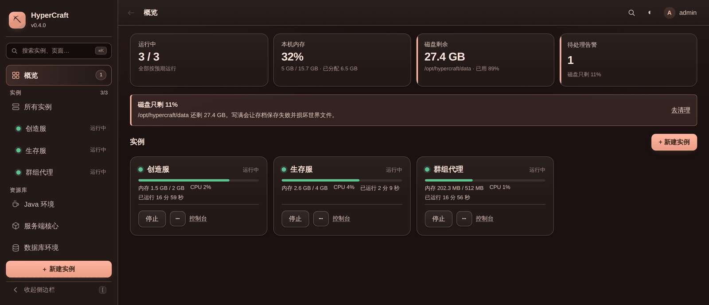

## 多实例与进程管理

一台机器上管任意多个服务器，侧栏实时状态。启动 / 优雅停止 / 重启 / 强制结束；停服走
`stop` → SIGTERM → SIGKILL 三级升级，卡死的服务器不会卡住面板。可选崩溃自动重启（连续失败 5 次后
放弃，退避 5→30 秒）。

**状态机**靠识别 `Done (x.xxs)!` 区分「启动中」和「运行中」，控制台输入在真正就绪前是禁用的。

**启动配置**：Java 路径、jar、`-Xms` / `-Xmx`、JVM 参数、服务端参数，也支持**完全自定义启动命令**，
用来跑基岩版服务端、`start.sh` 或者 BungeeCord。

跨平台：Linux / macOS 用进程组 + SIGTERM/SIGKILL，Windows 用 `taskkill /T`。

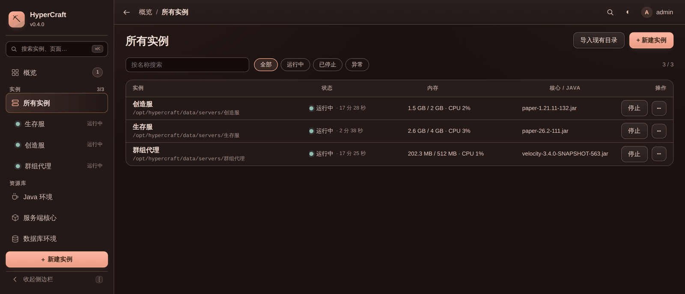

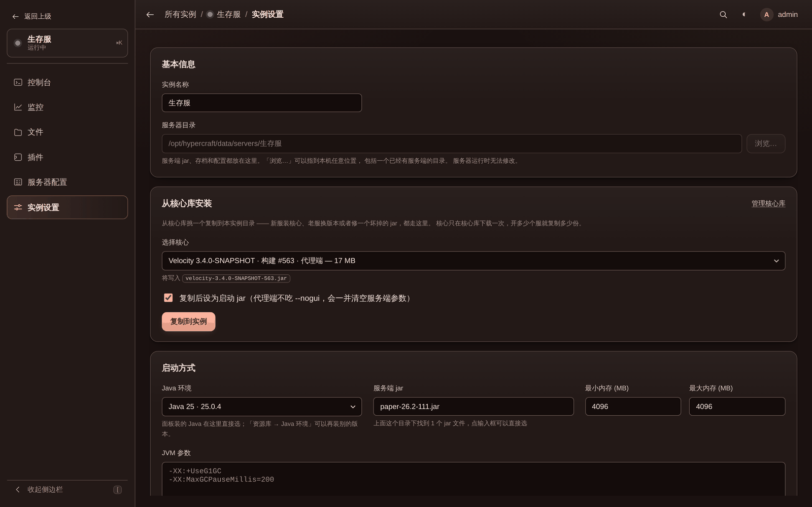

## Java 环境

「Java 环境」页可以一键下载 Eclipse Temurin 的 JRE / JDK（任意大版本，LTS 有标注），装进面板数据
目录，不碰系统里的 Java；每个实例在「启动设置」里各自选一个，所以 1.12 的老服和 1.21 的新服可以在
同一台机器上共存。列表里会显示系统自带的 Java、每个运行时被哪些实例用着，正在跑的不让删。手动解压进
`data/java/` 的 JDK 也会被自动认出来。

下载源可选：默认「自动」依次试清华 TUNA、南京大学、华为云、GitHub 加速，都不通才回 Adoptium 官方
（国内机器直连 GitHub 常年几十 KB/s，这一步能省掉大半个小时）；也可以指定某一个。**版本信息和
SHA-256 始终取自 Adoptium 官方 API**，镜像只负责传压缩包，对不上一律不装。

已知边界：Temurin 只有 glibc 构建，musl 系统（Alpine 之类）装了也跑不起来 —— 面板会检测到并直接
说明，让你改用系统包管理器装。

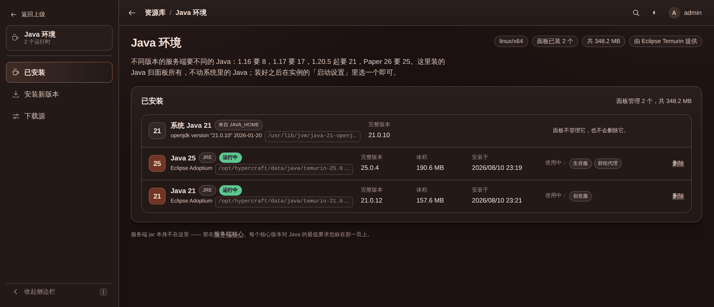

## 服务端核心库

面板级的 jar 货架，在「资源库 → 服务端核心」里管（分「核心库」和「下载核心」两页）。目前可下载的是
Paper 和 Velocity，数据来自 PaperMC 的 Fill API；下载好的核心留在 `data/cores/`，新建实例或在
「启动设置」里选一下就复制一份过去 —— 实例拿到的是自己的副本，所以删库里的核心不会动到正在跑的服。
自己丢进 `data/cores/` 的 jar 也会被认出来，一样能复制。

选版本后面板自己去下（走服务器的网络，不经过你的浏览器），下载归守护进程管，关掉网页也会继续，重开
页面能接上进度。落盘前校验 sha256 和体积，先写 `.part` 再改名 —— 失败、取消或断网都不会留下一个
看起来能启动的半截 jar，也不会默默覆盖已有文件。

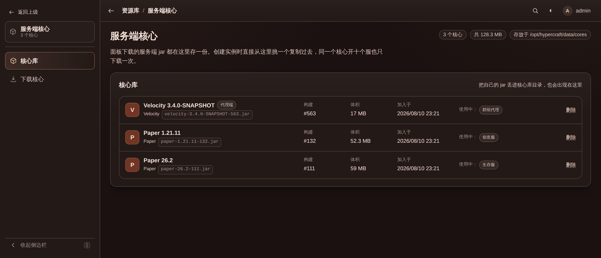

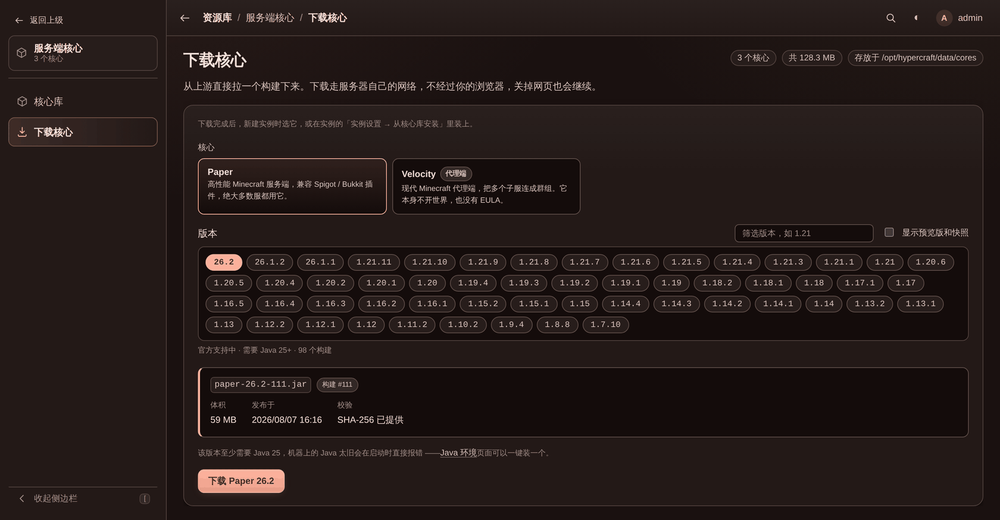

## 插件管理（全局 + 实例两层）

插件的**添加、来源、版本和更新统一在侧栏的「插件库」里管**，实例那边只能「拿来用、换版本、停用」。
这是有意的分工：如果每个服都能自己下载，同一个插件很快就会有六份说不清区别的副本，而最想回滚到的那个
旧版永远是被就地覆盖掉的那个。

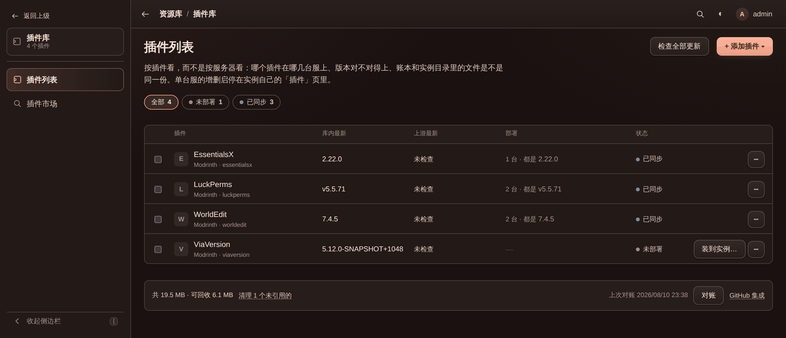

**插件市场**：Modrinth、Hangar、SpigotMC 直接搜，按你现有的服务端版本标兼容性。

**GitHub Release**：填一个仓库（`EssentialsX/Essentials`，或者直接把仓库地址粘进去），面板就从它的
Release 里拉 jar —— 和面板自己更新走的是同一条路（默认 `https://ghfast.top/`，镜像失败自动回落
GitHub 直连）。一个 Release 里挂了好几个 jar 时，默认会跳过 `-sources`、`-javadoc`、`-dev` 这类附带
包，在剩下的里挑最大的；不满意可以填个文件名通配（`EssentialsX-*.jar`）自己指定。预发布版默认不列。

**私有仓库**：自己写的插件发在私有仓库里也能管。在「面板设置 → GitHub 集成」里加一个访问令牌
（fine-grained 令牌给目标仓库 `Contents: Read-only`，classic 令牌勾 `repo`）就行。私有仓库的 jar
只能从 API 取，所以**不经过下载镜像** —— 镜像是第三方，没有你的令牌，也不该知道这个仓库存在。令牌
只发给 `api.github.com`，存在 `panel.json`（`0600`）里，接口只回答「有哪几个」「叫什么」「末尾四位」，
读不回原文。顺带一提，公开仓库配了令牌也有用：匿名 API 每小时 60 次会变成 5000 次。

**多个令牌**：令牌可以存好几个 —— 自己号一个、公司 org 一个 —— 每个插件在添加时挑用哪个读。删掉一个
令牌不会偷偷把用它的插件改到别的令牌上（那等于把 A 账号的凭证发给只该 B 看的仓库），它们会明说
「指定的令牌已经不在了」，等你去挑一个新的。

**每个版本单独存**：`data/plugins/<插件>/<版本>/`。很多插件每次发布都叫同一个 `Foo.jar`，按文件名存
的话新版会直接盖掉旧版，回滚时就没东西可回了。检查更新是手动点的（整体或单个）—— 匿名 GitHub API
一小时只有 60 次，页面自动刷新会把配额花在没人看的地方，所以结果是缓存下来的，卡片上会写清上次检查
是什么时候。想停在某一版，在版本列表里点「锁定在这个版本」，之后不再提示更新，批量升级也会跳过它。

**实例的「插件」标签**：从库里挑一个插件和版本装进去 —— 拿到的是**自己的副本**。换版本是一次操作：
新 jar 落地后旧的才删，不会出现同一个插件两个版本都在 `plugins/` 里害得服务器起不来。停用是把 jar
改名成 `.jar.disabled`（Bukkit 系只加载 `*.jar`），插件自己的配置目录原封不动。**这些都要重启服务器
才生效**，正在跑的时候界面会提醒。

不是面板装的 jar 也会列出来（自己传的、从备份恢复的），并且会**自动认出它是什么**：面板读 jar 自己的
描述文件（plugin.yml / paper-plugin.yml / bungee.yml / velocity-plugin.json / fabric.mod.json），
按服务器启动时读到的那个名字和版本显示，而不是文件名 —— `build-42-shaded.jar` 是谁，光看文件名没人
答得上来。点插件名打开抽屉能看到简介、作者、API 版本和**前置依赖**，依赖会跟这台服现有的插件比一遍
逐条标「已装 / 没装」（一个插件躺在 `plugins/` 里却没跑起来，十次里有八次是前置没装）。

如果它和插件库里某个版本**逐字节一致**（按下载时记的 SHA-256 比对），还会多一个「接管」按钮：点了它
就变成普通的受管插件，能换版本、能跟更新，磁盘上什么都不动。认不出的 jar 也能「导入插件库」——
面板直接在实例目录里把它读出来算校验和存进库，实例目录里的文件一动不动。Fabric / Forge 的模组把
「安装目录」填成 `mods` 就行，同一套机制。

一点实话：GitHub Release 没有官方校验和可对，所以那条路只能校验体积、记录下载到的 SHA-256，信任链
落在 GitHub 的 TLS 和你填的那个仓库上 —— 这和 Java 环境、服务端核心（都有上游发布的哈希可比对）
不一样。

## 数据库环境

半数常用插件都要数据库 —— LuckPerms 存权限、CoreProtect 存日志、Plan 存统计 —— 而「装个 MySQL」在
此之前意味着包管理器、service 文件、root 密码和一条 GRANT 语句，全都不是 Minecraft 知识，却挡在勾选
插件配置的前面。

「资源库 → 数据库环境」分三页：**我的数据库**（建库、启停、复制连接串）、**已装引擎**（引擎是数据库
程序本身，一次安装可供多个库共用）、**安装引擎**（下载）。整套东西归守护进程所有，关掉网页不影响
下载，也不影响正在跑的数据库；勾了「面板启动时自动开」的库会跟着面板一起起来，并且**排在服务端之前**
启动 —— 反过来的话，开机自启的服务端会连不上库，好几个插件会就此关闭自己。

建库时端口、账号和密码都有默认值（端口自动错开，密码自动生成），建完直接给出可以粘进插件配置的连接串
和 JDBC 地址。**默认只监听回环地址**：同一台机器上的服务端照常连，外面连不进来。

几点边界：

- 二进制都从官方或权威渠道取，能校验的都校验（MongoDB 用官方发布清单里的 SHA-256，PostgreSQL 用
  Maven 中央仓库的 SHA-1，MySQL 用官方的 MD5）。后两者强度不足以防替换，所以这一块**不提供镜像**。
- PostgreSQL 用的是 zonky.io 发布在 Maven 中央仓库的便携构建（官方不为 Linux 提供免安装包）。
- MySQL 在 Linux 上装官方精简包（60 MB 左右）；ARM 机器官方没出精简包，只能下完整包（近 1 GB）。
  macOS 上的 MySQL 请用 Homebrew。
- MySQL 和 MongoDB 的官方二进制依赖系统里的共享库（libaio、libnuma 等）。装完面板会先跑一次引擎
  自检，跑不起来就把原始报错和对应的安装命令一并写出来。跑不起来的引擎不允许建库。
- MongoDB 官方压缩包里不带 mongosh，面板没法给它建账号密码，所以 MongoDB 的库**只能监听回环地址**。
- 面板以 root 运行时，数据库会降权到一个普通系统账号再启动（PostgreSQL 根本拒绝以 root 运行）。
- 删除数据库时数据目录**默认保留**，要连数据一起删得在确认框里单独勾选。

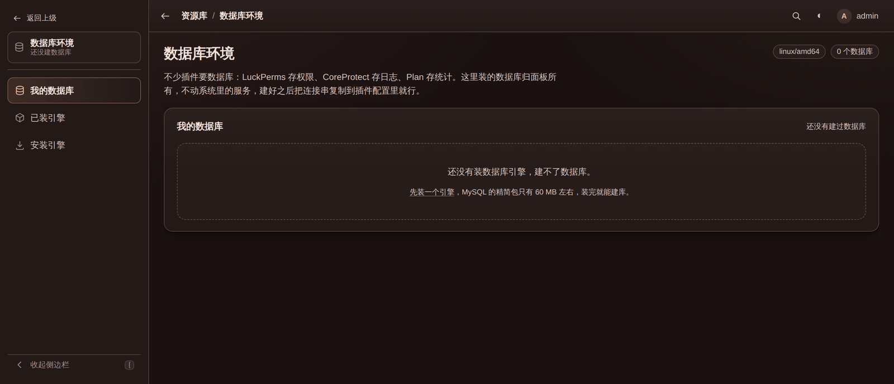

## 文件管理器

浏览实例目录、上传（点选或拖拽，带进度条，单文件默认上限 2 GB）、下载（支持断点续传）、重命名、
新建文件夹、递归删除，以及在线编辑文本配置（ops.json、bukkit.yml、插件配置等）。

所有路径操作都走 Go 1.25 的 `os.Root`，由**内核层面**把访问关在实例目录里 —— `..`、绝对路径、指向
外部的符号链接一律拒绝，不依赖字符串清洗。上传同名文件默认拒绝，会问一句再覆盖。

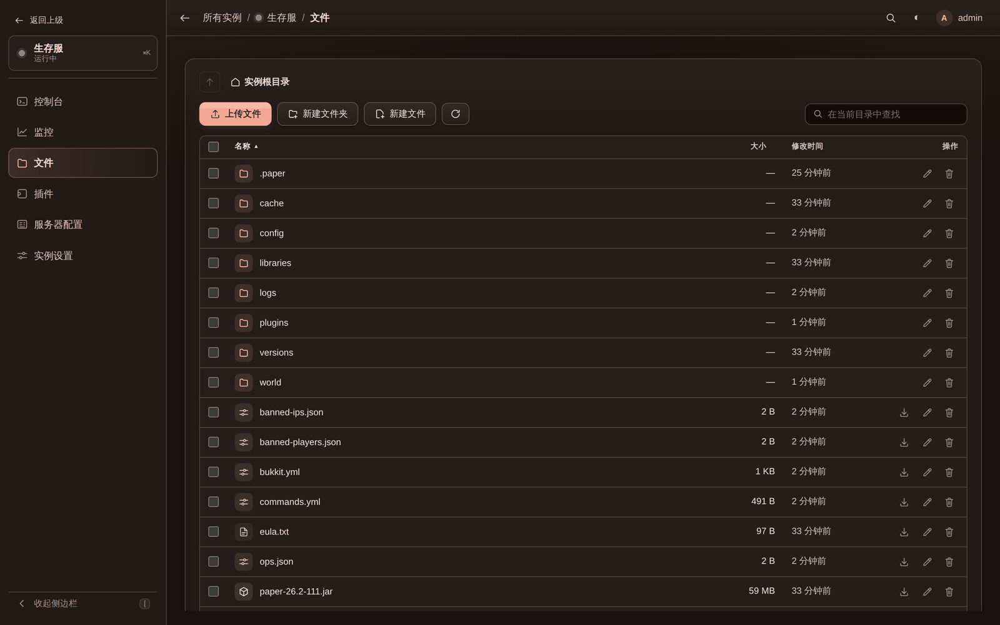

## server.properties 编辑器

常用项给了真正的表单控件，其余键按原样列出。三件容易踩坑的事都处理了：

- 保留注释、空行和键顺序（你手改过的文件不会被打乱）；
- 中文自动转成 `\uXXXX`（Minecraft 按 ISO-8859-1 读这个文件，直接写 UTF-8 会乱码）；
- 只写你真正改过的键 —— 打开页面直接点保存不会把 `online-mode=false` 这种默认值悄悄写进去。

EULA 也在这一页：一键写 `eula=true`，旁边就是 Mojang 协议链接。

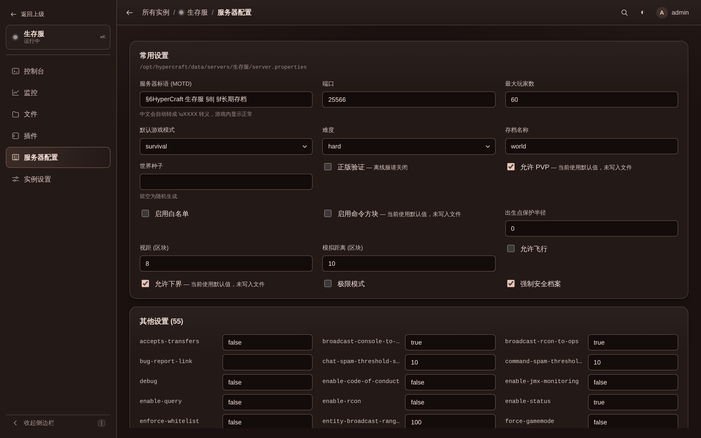

## 资源监控

每个实例的 CPU 和内存曲线，5 秒采样、内存里保留 1 小时，面板守护进程采集，所以关掉网页也不断档。

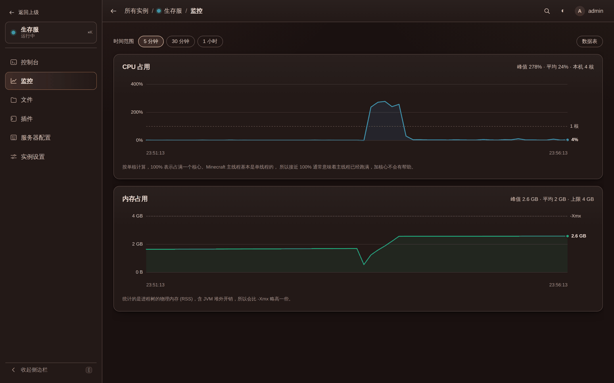

主机监控页另有**网络流量**：上下行两条曲线和自面板启动以来的累计收发。只统计真正出得去的网卡 ——
回环、docker / veth / 网桥 / 隧道都不算，那些字节会在物理网卡上再数一遍，全加起来会得到两三倍于真相
的数字。人多的服往往是带宽先到顶，而不是 CPU。

累计量从**面板启动**算起而不是开机：内核的计数器是自开机以来的总数，一台跑了半年的机器上，那个数
回答的不是任何人问过的问题。

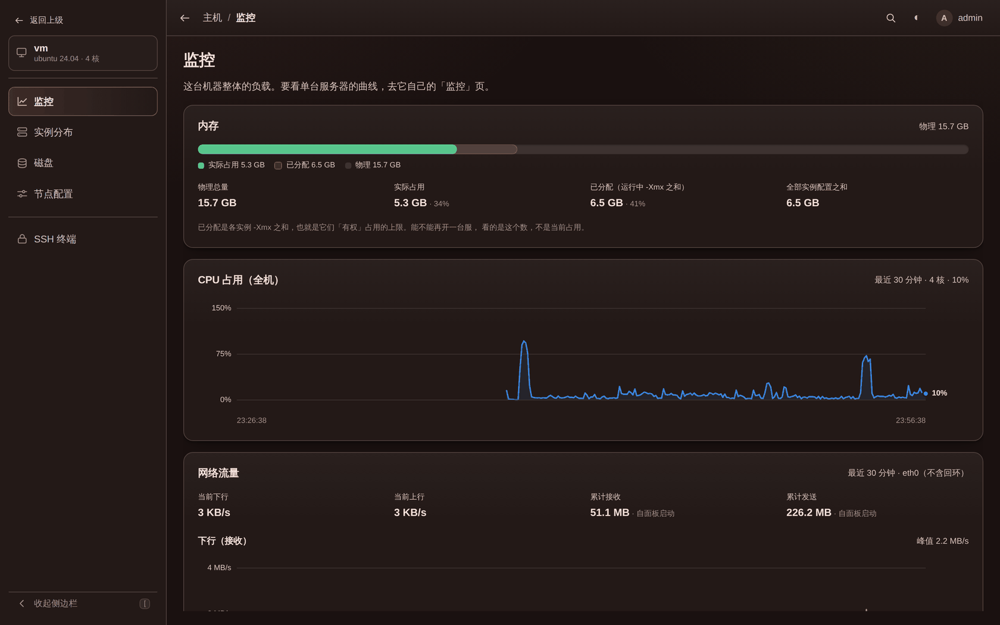

## 本机终端

「设置 → 终端」打开开关后，侧栏会多一个终端页，里面是面板所在这台机器的一个真 shell（伪终端，
`top`、`vim`、Ctrl-C、颜色和 Tab 补全都正常）。它跑的**就是本机**、用的就是面板进程的身份，不是连到
别的服务器，所以没有任何 SSH 密钥或密码要存在面板里。

> [!WARNING]
> **这个开关默认是关的，升级面板也不会把它打开。** 开了它，面板密码就等价于这台机器的 SSH 密码：
> 任何能登录面板的人都能以运行面板的那个用户执行任意命令。所以开之前先确认密码够强、面板没有裸奔在
> 公网上。关掉开关会立刻挂断已经开着的会话，不只是拦住新连接。

会话是跟着页面走的：关掉标签页就挂断，连同它启动的程序一起（先 SIGHUP，3 秒后 SIGKILL）—— 这一点和
实例控制台正好相反，因为没人看着的 shell 只会把命令留在半路。要让命令活得比标签页久，请用 systemd，
或者在终端里开 tmux / screen。同时最多 4 个会话。

界面上这块画布和服务器控制台的配色刻意不同 —— 那是防止把危险命令敲进错误终端的唯一屏障。

Windows 上不可用（需要 ConPTY，暂未实现），面板会直接说明，开关也点不动。

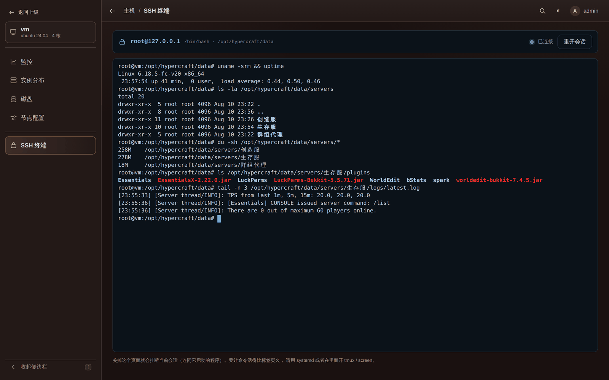

## 面板自更新

有新版本时侧栏会标出来，「面板设置 → 面板更新」点一下就更新，不用 SSH 上去换二进制。

更新分两步：**第一步下载校验新版本，同时优雅停止所有服务器**（两件事互不依赖，一个几十兆的包和一个
大世界的存盘没必要排队）；**第二步在服务器全部停稳之后**才换二进制、用 `exec` 就地重启（PID 不变，
systemd 察觉不到），然后自动把刚才在跑的服务器拉回来。任何一步失败都不动二进制，并且把这次停掉的
服务器重新拉起来。更新期间不能启动服务器。确认弹窗会列出要停哪几个，更新页会实时显示下载进度和还在
等哪台服存档。旧二进制留作 `hypercraft.old` 方便回退。

下载默认走 `https://ghfast.top/` 镜像（国内直连 GitHub 的下载速度基本没法用），界面上可以换成别的或
直连，镜像挂了自动回退直连。**镜像只搬压缩包**：校验用的 `SHA256SUMS.txt` 优先从 GitHub 直接取，
所以镜像换不掉二进制 —— 它给的包对不上 GitHub 的哈希就会被拒绝。

**更新通道**分「正式版」和「快照」，默认正式版。快照是 main 分支每个通过 CI 的提交自动出的一版
（`0.5-snapshot.86` 这种，标着 prerelease），想提前试新功能可以在更新页切过去，更新流程和正式版完全
一样。快照通道同时也看正式版 —— 按版本号取最新的那个，所以 `0.5.0` 一发布就会自动从 `0.5-snapshot.*`
更新过去。生产环境请留在正式版通道：快照只保证过了 CI。

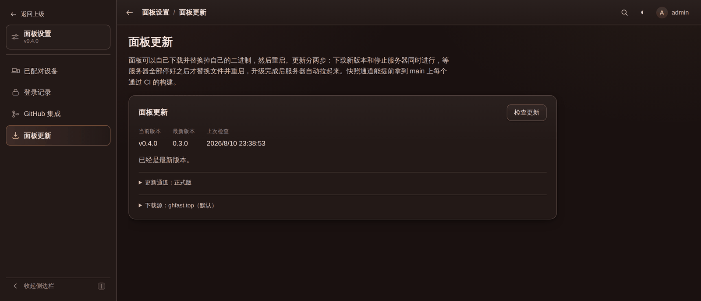
