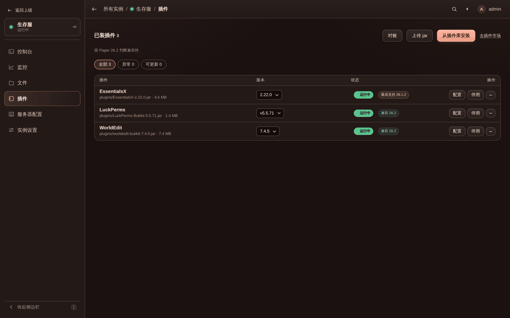

# 上手指南

面板已经跑起来了（还没有的话先看[部署指南](deployment.md)），这一页是开出第一台服务器。

## 开一个新服

侧栏点「+ 新建实例」，五步向导，顺序就是这些东西互相依赖的顺序 —— 每一步都可以往回改，直到最后一步
按下创建为止，磁盘上什么都不会变。

1. **服务端核心** —— 从核心库挑一个，或者**就在这一步下载一个新的**（项目、版本、构建信息和下载进度
   都在页面里，下完自动选上），或者「先不放核心」自己传 jar。目前可下载的是 Paper 和 Velocity，
   数据来自 PaperMC 的 Fill API；自己丢进 `data/cores/` 的 jar（Fabric、Forge、整合包服务端）也会
   出现在库里。
2. **Java 环境** —— 按上一步选的核心算出它要哪个 Java，逐个标「可用 / 版本过低 / 可能太新」，并且
   **就在这一步装**。默认选的是满足要求里**最低**的那个：1.16.5 挑 Java 8 而不是 21，因为老服务端
   在新 Java 上一样起不来。
3. **名称与位置** —— 名字随便起（中文没问题，目录名会跟着走），目录留空就放在数据目录的
   `servers/<名字>/` 下；也可以「浏览…」指到本机任意位置 —— 外挂硬盘、NAS 挂载点，或者一个你已经有
   服务端的目录。内存档位对着本机内存给，超过八成会警告。
4. **服务器设置** —— 端口、MOTD、最大玩家数、难度、游戏模式、**存档名和世界种子**，以及 EULA。
   种子和存档名放在这一步是有原因的：世界一旦生成就改不动了。代理端（Velocity）没有世界也没有
   EULA，这一步整个不出现。
5. **确认创建** —— 把每个答案读一遍，然后按顺序建实例、复制核心、写 EULA、写配置。

创建完直接进「控制台」点启动。

## 接管机器上已有的服务器

「所有实例 → 导入现有目录」。选中目录后面板会就地读一遍并把看到的东西摆出来 —— 哪个 jar 像服务端、
有哪些世界、多少插件、端口和 MOTD、EULA 同意了没有 —— 确认之后只往面板自己的实例表里写一条记录，
目录里的东西一个字节都不动。

已经被别的实例占着的目录会被拒绝：两个实例指同一个世界，一起开服会写坏存档。

目录里已经有的插件 jar 也会被列出来并**自动认出它是什么**（读 plugin.yml / paper-plugin.yml /
bungee.yml / velocity-plugin.json / fabric.mod.json），详见[功能详解](features.md#插件管理全局--实例两层)。

## 装插件

插件的**添加、来源、版本和更新统一在侧栏的「插件库」里管**，实例那边只负责「拿来用、换版本、停用」。

1. 「插件库 → 插件市场」搜一个（Modrinth / Hangar / SpigotMC），或者「添加插件」填一个 GitHub 仓库。
2. 在插件页面挑一个版本下载到库里。
3. 回实例的「插件」标签点安装 —— 拿到的是**自己的副本**，删掉库里的插件不会动到已经装上的服。
4. 重启服务器生效（正在跑的时候界面会提醒）。

## 常见问题

**服务器起不来，控制台说 `UnsupportedClassVersionError` 或者直接闪退。**
Java 版本对不上。1.20.5 起要 Java 21，Paper 26.x 要 25；反过来，老服务端在太新的 Java 上一样起不来。
去「实例设置 → 启动设置」换一个 Java，没有的话在「Java 环境」页装。

**控制台一片空白，看着像卡死了。**
先看「监控」页有没有 CPU 占用。世界生成、区块预生成、Forge / NeoForge 安装器这类只输出 `\r` 的进度条
在终端模式下是能看到的；如果你关掉了终端模式换回管道，那就真的看不到，把它开回来。

**中文变成乱码。**
用自定义启动命令（`start.bat`、基岩版、BungeeCord）时面板加不了 JVM 编码参数。去「启动设置 → 控制台」
把「输出编码」直接选成 GBK。细节见[控制台](console.md#编码)。

**改了 `server.properties` 没生效。**
Minecraft 只在启动时读它，重启服务器。

**面板重启之后手机 App 被登出了。**
不应该 —— 设备令牌是持久的，会话才是内存里的。如果确实被登出了，检查是不是刚改过密码：
**改密码会解除所有设备的配对**。见[安全与访问控制](security.md#原生客户端与设备令牌)。

**忘了面板密码。**
停掉面板，`hypercraft -data <数据目录> -reset-password`，再启动。
