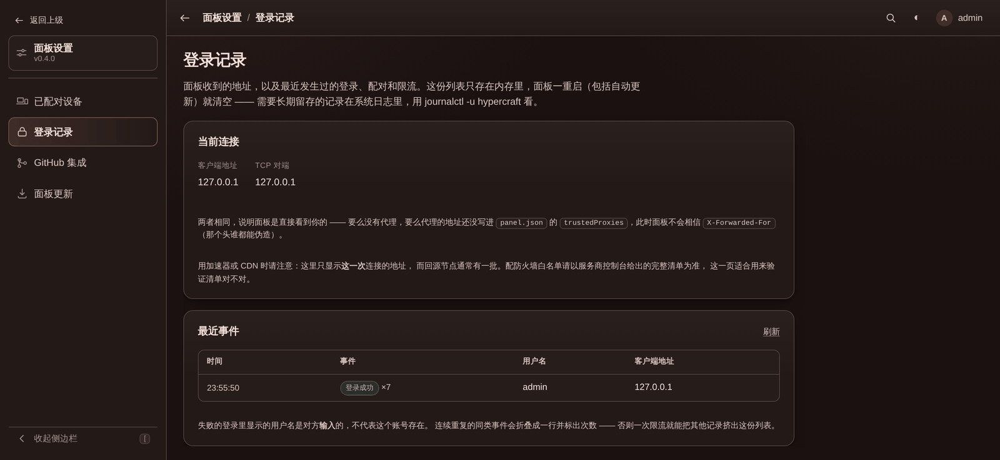

# 安全与访问控制

面板能在你的机器上执行任意控制台命令，公网部署请先看[部署指南里的 TLS 一节](deployment.md#反向代理与-tls)。
这一页讲的是面板自己的那几道防线。

- [账号与角色](#账号与角色)
- [鉴权](#鉴权)
- [登录保护](#登录保护)
- [在反代 / 加速器后面](#在反代--加速器后面)
- [排查：到底是哪个地址在访问面板](#排查到底是哪个地址在访问面板)
- [原生客户端与设备令牌](#原生客户端与设备令牌)

## 账号与角色

面板有账号，一个账号持有一个角色，角色是一组**能力**的集合。能力词表由面板定义（26 条），
操作者不能发明新的，但可以任意组合成角色。账号和角色存在 `users.json`（`0600`）里。

出厂三个角色：**管理员**（内置，恒等于全部能力，改不了删不掉）、**运维**、**开发**。
后两个建好之后就是普通角色，随便改随便删。

### 哪些边界是真的

这一节比上面的列表重要。**服务端进程和面板跑在同一个系统用户下** —— 全仓库唯一降权的地方是
数据库运行时（因为 MySQL 拒绝以 root 启动）。于是只要能让服务端 JVM 执行代码，就等于拿到了面板
那个系统用户：`users.json` 里的密码哈希、`panel.json` 里的 GitHub 令牌、`databases.json` 里的
明文数据库密码、其他所有实例的目录，全都能读能写。

通向那里的路有三条，角色编辑器里都会标成危险能力：

| 能力 | 为什么危险 |
| --- | --- |
| 编辑、上传与删除文件 | 往 `plugins/` 传一个 jar，JVM 加载即执行 |
| 管理实例插件 | 同上，只是走的是插件库 |
| 启动设置与核心 | 启动参数里的 `command` 是完整 argv；实例目录可以指向任意路径 |

另外几条虽然不通向代码执行，但同样标成危险：新建实例（可选任意宿主机目录）、数据库（明文密码）、
本机终端、浏览主机目录、面板更新、面板凭据与镜像、用户与角色（能给自己加权限）。

所以：

- **「运维」是真边界。** 它碰不到宿主机文件系统。但要知道**控制台等于游戏内最高权限** —— 能
  `/op` 任何人。
- **「开发」不是安全边界。** 它防的是误操作和职责混乱，不防人。给一个人开发角色，等于信任这个人
  能登进这台机器。
- **能读某个实例配置的人，能读到这个实例的全部凭据** —— rcon 密码、bot token、插件里的数据库账号。
  配置历史默认给这些打码，但点一下就能看。

真正的隔离需要每个实例跑在独立系统用户下，面板目前不做这件事。

### 实例授权

授权是和角色正交的第二个维度：**角色说「能做什么」，授权说「对哪些服」**，两样都满足才放行。

- **没设置**（`null`）= 全部实例，包括以后新建的。升级上来的账号、管理员，都是这个。
- **空列表**（`[]`）= 一个都碰不到。这两者必须分得开，所以 `users.json` 里这个字段不会因为是
  空值就消失。
- 管理员的授权**强制为全部**。限制管理员是做戏 —— 他能改自己的授权。

**没被授权的实例返回 404，不是 403。** 403 等于告诉对方「这个 id 是个真实存在的服务器」，而这正是
授权要挡住的事。

**列表也一样。** 实例列表、仪表盘计数、插件总览、批量升级的影响范围、建筑安装目标、代理候选子服，
看到的都只有自己被授权的那些 —— 泄露一般不在 `/api/instances/{id}` 这种明显的地方，而在「哪些服
装了这个插件」这类聚合视图里。

有能创建实例的能力时，**新建的实例会自动加进创建者的授权**，否则他建完就看不见了。删除实例会把它
从所有授权列表里清掉。

### 两处例外

**代理连线不受实例授权限制。** 一条链路是关于两个实例的事实，哪一端都不拥有它，所以它是面板级
能力。给出这项能力，等于允许对方改动任意两个实例的那几个配置文件。半张图比没有图更容易让人配错，
所以这里选择不过滤。

**必须看到全部实例的安全检查不受限制。** 删除一个还在被使用的 Java 运行时、把已经属于某个实例的
目录再分配给另一个实例、两个实例抢同一个端口 —— 这类检查如果只看得到调用者自己的实例，结果就是
一个人能悄悄搞坏另一个人的服务器。代价是这类拒绝的提示里可能出现调用者看不到的实例名，这是值得的
交换，也是为什么它们都在面板级能力后面。

### 控制台分读写

控制台的 WebSocket 一条连接承载两个方向：推送输出要「查看服务器」，发送命令要「发送控制台命令」。
只有前者的角色连上去是**只读**的 —— 看得到输出，敲进去会被拒绝，而不是握手失败。他确实有权看。

### 还没做的

**界面。** 账号、角色和实例授权目前只能通过 API 管理：`/api/users`、`/api/roles`、
`/api/capabilities`，都要求「用户与角色」能力。

**目录白名单**（「只让他改 `plugins/MyPlugin/` 这个目录」）。设计已经想好了，还没实现。

### 一些保证

- **至少保留一个启用中的管理员。** 删除、停用、改角色，只要是最后一个管理员就会被拒绝 ——
  一个没人进得去的面板，是没法从面板里修好的。
- **停用或删除立刻生效。** 账号是每个请求重新读的，不是等会话过期；已签发的会话和设备令牌
  当场作废。
- **改密码只影响自己。** 自己的会话和设备全部失效，别人的不动。
- **设备令牌属于配对时用的那个账号**，继承它的角色，「我的设备」里也只看得到自己的。

## 鉴权

- 密码用 **PBKDF2-SHA256（210k 轮）** 存，写在 `users.json`（`0600`）里。用户名不存在和密码错误
  **花掉同样的时间** —— 查不到账号时面板会拿一份诱饵凭据照样跑一遍 PBKDF2，不然光看响应快慢
  就能把面板上有哪些用户名问出来。
- 浏览器会话是 **HttpOnly + SameSite=Strict** 的 Cookie，存在内存里，面板一重启（包括自更新）就全部
  失效；改密码会让**这个账号**的全部会话失效。
- 所有改状态的接口要求自定义头 `X-HyperCraft`，WebSocket 校验 Origin。

## 登录保护

校验一次密码约 0.1 秒的单核 CPU。这对存储密码是正确的成本，但 `/api/auth/login` 和
`/api/auth/devices` 都是公开的 —— 不限制的话，猜密码和把 CPU 从 Minecraft 服务端手里抢走这两件事，
任何人都能做，而且后者连密码都不用猜对。

两道限制各管一件事，谁也替代不了谁：

- **按客户端地址限速** —— 连续 5 次失败后开始限流，每 30 秒回一次机会，返回 `429` 并带 `Retry-After`。
  只有**失败**扣次数，登录成功会把该地址的记录清空，所以连打几个错字再输对不会被罚。被限流的请求约
  4ms 返回，不再跑 PBKDF2。
- **并发派生上限** —— 同时进行的密码校验数被限制在约 1/4 的核数（下限 2），排不上就返回 `503`。
  这一道才是真正兜住 CPU 的：换多少个源地址都绕不过去。

配对接口和修改密码接口与登录**共用同一份额度** —— 不然把一扇门敲满之后换另一扇继续敲就行了。



## 在反代 / 加速器后面

限速按「客户端地址」计数，而面板默认只认 TCP 对端地址。**直连时这是对的**：`X-Forwarded-For` 是任何
客户端都能随手写的头，无条件相信它等于让攻击者每个请求换一个计数桶，限速直接失效。

但在 Nginx 反代、CDN 或者阿里云 GA 这类加速器后面，所有请求都从少数几个回源地址进来，全算作同一个
客户端的话，一个攻击者就能把所有人一起锁在门外。这时在 `panel.json` 里列出那些地址：

```json
{
  "trustedProxies": ["127.0.0.1", "10.0.0.0/8", "203.0.113.7"]
}
```

支持 CIDR，也支持写单个 IP（按 /32、/128 处理）。只有当 TCP 对端命中这个列表时，面板才会去读
`X-Forwarded-For`，并且取的是**最右侧那个不属于可信代理的地址** —— 每一跳都往右追加自己看到的地址，
所以左边的部分是客户端自己写的，取左边就等于把计数桶交给攻击者挑。条目写错不会导致面板起不来，只会
在启动日志里告警并跳过那一条。

> 阿里云 GA 的回源地址在 **控制台 → 实例 → 监听详情 → 终端节点出公网 IP** 里能查到。注意那是**一批**
> 地址而不是一个（每个加速地域都有），并且增删加速地域时会变化，所以别只填你抓包看到的那一个。

## 排查：到底是哪个地址在访问面板

**在面板里看：「面板设置 → 登录记录」。** 上半页是当前这次连接的两个地址，下半页是面板启动以来的
登录、配对和限流事件，每条都带客户端地址和 TCP 对端：

```
当前连接
  客户端地址  203.0.113.9      ← trustedProxies 生效时，代理转告的真实客户端
  TCP 对端    10.1.2.3         ← 代理回源到面板的地址，防火墙要放行的是这个

最近事件
  10:45:10  已限流 ×2    —      198.51.100.7
  10:45:09  密码错误 ×5  root   198.51.100.7
  10:45:09  登录成功     admin  203.0.113.9
```

连续重复的同类事件会折叠成一行并标次数，否则一次限流就能把其他记录挤没。这份列表**只存在内存里**，
面板一重启（包括自动更新）就清空。

**需要长期留存的记录看系统日志**，那才是权威来源：

```bash
journalctl -u hypercraft | grep -E 'signed in|failed login'
```

```
level=INFO msg="signed in"    username=admin remote=10.1.2.3:41522 client=203.0.113.9
level=WARN msg="failed login" username=admin remote=10.1.2.3:41530 client=203.0.113.9
```

没配 `trustedProxies` 时 `client` 就等于 `remote` 的地址部分。

> 用加速器时注意：这里显示的是**已经连过**的地址，而回源节点通常有一批。防火墙白名单要以服务商控制台
> 给出的完整清单为准（GA 见上一节），这一页适合用来**验证**清单对不对，不适合用来生成清单。

## 原生客户端与设备令牌

浏览器之外的客户端（桌面端、Android）用**设备令牌**认证，而不是会话 Cookie。配对一台设备：

```bash
curl -X POST https://panel.example.com/api/auth/devices \
  -H 'Content-Type: application/json' \
  -d '{"username":"你的用户名","password":"你的密码","name":"我的手机"}'
```

返回里的 `token` **只出现这一次** —— 面板只保存它的摘要，丢了就重新配对。之后每个请求带上：

```
Authorization: Bearer hcd_xxxxxxxx...
```

控制台的 WebSocket 也走同一个头，不需要另外的握手方式。

设备令牌和浏览器会话是两套凭证，互不通用：

- 会话存在内存里，面板一重启（包括自更新）就全部失效。对坐在电脑前的人无所谓。
- 设备令牌写进 `panel.json`，重启照常能用 —— 否则面板每更新一次，手机就被登出一次。
- **令牌属于配对时用的那个账号**，继承它的角色 —— 配对是另一条进门的路，不是绕过角色的路。
  拿运维账号配对出来的令牌，照样碰不到本机终端。
- 每台设备可以单独吊销：面板里在「面板设置 → 已配对设备」看列表和解除配对，也可以走
  `GET /api/auth/devices` 和 `DELETE /api/auth/devices/{id}`。**这两个接口都只看得到自己的设备**，
  别人的设备 id 会返回 404。在 App 里退出登录也会解除当前这台的配对。
- **改密码会解除这个账号所有设备的配对**，需要重新配对。停用或删除账号同样会让它的令牌立刻失效。
- 被拒绝的令牌会记进登录记录（`设备令牌无效`）—— 猜一个 32 字节随机令牌没有意义，这条记录真正要抓的
  是「某个 app 还在拿已经解除配对的令牌请求」。

> [!WARNING]
> **配对之前先把 TLS 配好。** 设备令牌是长期凭证，不像会话那样过几天自己失效，在明文 HTTP 上它会随
> 每个请求原样过一遍网络。面板默认监听 `0.0.0.0`，手机开箱即可连上，也正因为如此，反代加 TLS 不是
> 建议而是前提。用明文 HTTP 配对时面板会在日志里警告，但不会阻止你。

Android 9 以上默认禁止明文 HTTP，所以客户端连非 HTTPS 的面板还需要额外配置 `networkSecurityConfig`
—— 又一个直接上 TLS 更省事的理由。
